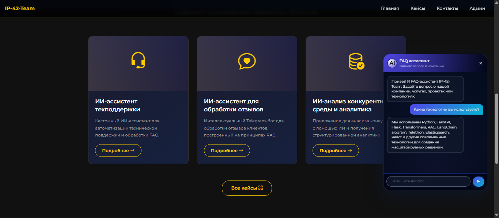

<div align="center">

# 🚀 IP-42-Team Website

**Современный веб-сайт компании с AI-ассистентом**

**[Открыть сайт](http://193.233.174.246/)**

</div>

---

## 🌐 О проекте

Современный веб-сайт на Flask с админ-панелью, формой обратной связи, портфолио кейсов и AI-FAQ-чат-ботом на базе RAG.

## ✨ Возможности

- **Главная страница** с hero-блоком и превью кейсов
- **Страница кейсов** с детальным описанием проектов
- **Форма обратной связи** с валидацией данных
- **Админ-панель** с управлением заявками и статистикой
- **FAQ Chat Widget** — AI-ассистент на базе RAG для ответов на вопросы о компании
- **Тёмная тема** с современным дизайном
- **Адаптивная верстка** (mobile-friendly)

## 📸 Скриншот раздела "Кейсы" и работы AI-ассистента



---

## 🛠 Технологии

### Frontend
- **HTML5, CSS3, JavaScript (Vanilla)**
- **Bootstrap 5.3.2** — CSS-фреймворк
- **Bootstrap Icons** — иконки
- **Google Fonts (Montserrat)** — типографика

### Backend
- **Python 3.9+**
- **Flask** — веб-фреймворк (основной сайт)
- **FastAPI** — асинхронный фреймворк (FAQ сервер)
- **SQLAlchemy** — ORM для работы с БД
- **Flask-WTF** — формы и CSRF защита

### AI & NLP
- **ProxyAPI** — OpenAI-совместимый API
- **FAISS** — векторный поиск (Facebook AI Similarity Search)
- **text-embedding-3-small** — эмбеддинги
- **RAG (Retrieval-Augmented Generation)** — генерация ответов на основе базы знаний

### Инструменты
- **uvicorn** — ASGI сервер для FastAPI
- **Gunicorn** — WSGI сервер для production
- **Supervisor** — управление процессами на VPS
- **Nginx** — веб-сервер и reverse proxy

### База данных
- **SQLite** — для разработки
- **PostgreSQL** — для production (рекомендуется)

---

## 📁 Структура проекта

```
project/
├── app.py                 # Основное приложение Flask (порт 5000)
├── config.py              # Конфигурация
├── requirements.txt       # Зависимости
├── README.md              # Документация
├── deploy.sh              # Скрипт деплоя на VPS
├── .gitignore             # Git игнорирование
├── screenshot.png         # Скриншот сайта
├── database/              # База данных SQLite
│   └── site.db
├── templates/             # HTML шаблоны
│   ├── base.html
│   ├── index.html
│   ├── cases.html
│   ├── case_detail.html
│   ├── contact.html
│   └── admin/
├── static/                # Статические файлы
│   ├── css/style.css
│   ├── js/main.js
│   └── widget/            # FAQ виджет (JS)
│       └── chat-widget.js
└── widget/                # FAQ сервер (порт 8000)
    ├── app.py
    ├── build_index.py
    ├── rag_index.py
    ├── start-faq.ps1
    ├── requirements.txt
    ├── .env
    └── data/
        ├── faqs.json
        ├── doc1-5.txt
        └── (faiss_index.bin, faqs_metadata.npy)
```

---

## ⚙️ Быстрый старт

### 1. Создание виртуального окружения

```powershell
python -m venv venv
.\venv\Scripts\Activate.ps1
```

### 2. Установка зависимостей

```powershell
pip install -r requirements.txt
```

### 3. Запуск FAQ сервера (первая вкладка)

```powershell
cd widget
uvicorn app:app --host 0.0.0.0 --port 8000
```

⚠️ **Важно:** `python app.py` в папке widget **не работает** — используйте `uvicorn`.

### 4. Запуск основного сайта (вторая вкладка)

```powershell
cd ..
python app.py
```

Сайт доступен: **http://localhost:5000**

### 5. Первый запуск FAQ

```powershell
cd widget
# Создайте .env с API ключом ProxyAPI
python build_index.py
cd ..
uvicorn app:app --host 0.0.0.0 --port 8000
```

---

## 🤖 FAQ Chat Widget

Виджет встроен на все страницы сайта. Кнопка чата 💬 в правом нижнем углу.

### Настройка FAQ

1. Создайте `widget/.env`:
```
OPENAI_API_KEY=sk-ваш-ключ
OPENAI_BASE_URL=https://api.proxyapi.ru/openai/v1
OPENAI_MODEL=gpt-4.1-mini
OPENAI_EMBEDDING_MODEL=text-embedding-3-small
```

2. Постройте индекс:
```powershell
cd widget
python build_index.py
```

3. Запустите FAQ сервер:
```powershell
uvicorn app:app --host 0.0.0.0 --port 8000
```

### Добавление новых FAQ

Откройте `widget/data/faqs.json` и добавьте вопросы:

```json
{
  "question": "Ваш вопрос",
  "answer": "Ответ на вопрос"
}
```

Перестройте индекс:
```powershell
python build_index.py
```

### Troubleshooting

| Проблема | Решение |
|----------|---------|
| Сервер сразу закрывается | Запускайте через `uvicorn app:app --host 0.0.0.0 --port 8000` |
| OPENAI_API_KEY is not set | Проверьте `widget/.env` |
| Не удалось получить ответ | Проверьте что FAQ сервер запущен на порту 8000 |

**Подробнее:** [widget/README.md](widget/README.md)

---

## 🔐 Админ-панель

**URL:** `http://localhost:5000/admin/login`

**По умолчанию:**
- Логин: `admin`
- Пароль: `admin123`

> ⚠️ **Измените пароль в production!**

**Функции:**
- Просмотр сообщений из формы обратной связи
- Отметка прочитанных/непрочитанных
- Удаление сообщений
- Управление кейсами

---

## 📝 Кейсы

1. **ИИ-ассистент техподдержки** — автоматизация технической поддержки и обработки FAQ
2. **ИИ-ассистент для обработки отзывов** — анализ отзывов клиентов с использованием RAG
3. **ИИ-анализ конкурентной среды и аналитика** — приложение для анализа конкурентов с помощью ИИ

---

## 🎨 Дизайн

| Параметр | Значение |
|----------|----------|
| Шрифт | Montserrat (Google Fonts) |
| Цвет фона | `#111` (тёмный) |
| Цвет акцента | `#ffcc00` (жёлтый) |
| CSS-фреймворк | Bootstrap 5.3.2 |
| Иконки | Bootstrap Icons |

---

## 🔧 Конфигурация

`config.py`:
```python
SECRET_KEY = 'your-secret-key'  # Измените!
ADMIN_USERNAME = 'admin'
ADMIN_PASSWORD = 'admin123'     # Измените!
SQLALCHEMY_DATABASE_URI = 'sqlite:///database/site.db'
FAQ_API_BASE = 'http://localhost:8000'
```

---

## 🚀 Production

### VPS (Ubuntu)

```bash
# Nginx + Gunicorn + Supervisor
pip install gunicorn
gunicorn -w 4 -b 0.0.0.0:5000 app:app
```

### SSL (HTTPS)

```bash
certbot --nginx -d ваш-домен.com
```

---

## 📊 База данных

**Таблицы:**
- `admins` — администраторы
- `contact_messages` — сообщения из формы
- `cases` — кейсы/проекты

**Сброс:** удалите `database/site.db`

---

## 📄 Документация

- [Основной README](README.md) — этот файл
- [FAQ Widget README](widget/README.md) — документация AI-ассистента

---

## 🤝 Поддержка

Для вопросов используйте форму обратной связи на сайте.

**Email:** [po42pi@gmail.com](mailto:po42pi@gmail.com)  
**Telegram:** [@prompt_ivan](https://t.me/prompt_ivan)  
**Телефон:** +7 (909) 323-66-00

---

## 📄 Права

© 2026 IP-42-Team. Все права защищены.

---

<div align="center">

🚀

</div>
